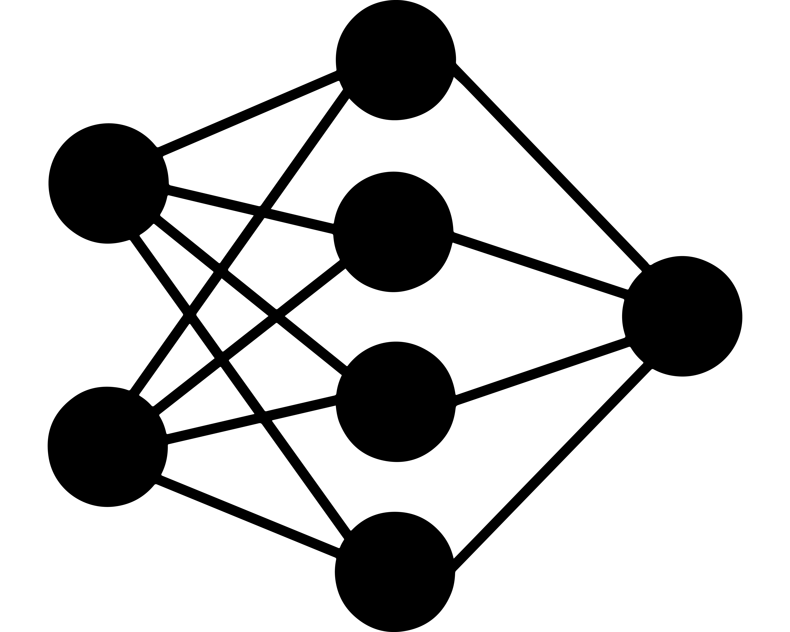

 

  

  <h3 align="center">ML projects Repoitory</h3>

  

    Dive Deep Learning about AI cutting edge technologies!
     
     
    <a href="https://github.com/hassenhamdi/ML_Projects"><strong>Explore the docs »</strong></a>
     
     
  

    

## Table Of Contents

* [About the Project](#about-the-project)
* [Built With](#built-with)
* [License](#license)
* [Authors](#authors)

## About The Project

This repository is newly made for the purpose to showcase and demonstrate my ML project , I will be maintaining it,insh'Allah ,with interesting projects and demo for all different AI domains and applications and some comprehensive notebooks . 

## Built With

Fully using python , and tensorflow cuda library .

## License

Distributed under the MIT License. See [LICENSE](https://github.com/hassenhamdi/ML_Project/blob/main/LICENSE.md) for more information.

## Authors

* **Hassen Hamdi** - *Computer Science Student* - [Hassen Hamdi](https://github.com/https://github.com/hassenhamdi/) - *ML project and notebooks*
